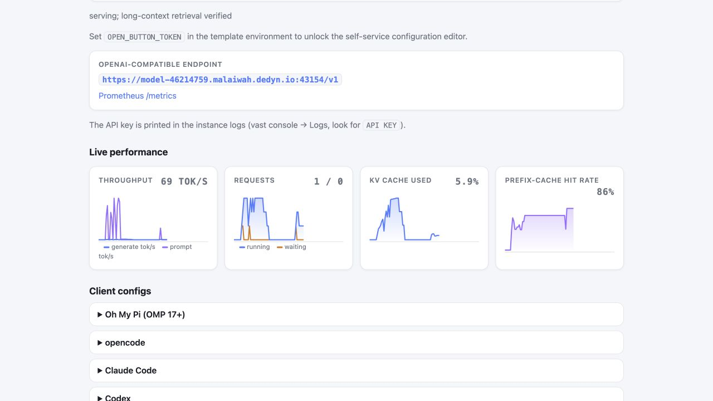

# Model turnkey for Vast.ai, Runpod, and JarvisLabs

One image, coherent profiles for **GLM-5.2**, **Qwen3.6-27B**, and compatible
vLLM checkpoints. It supplies an authenticated OpenAI-compatible endpoint,
persistent model downloads and compile caches, a live dashboard, key-only SSH,
provider-aware URLs, optional TLS, crash supervision, and an opt-in embedded
diagnostic [SOUL](docs/soul.md).

The default `glm52-exl3` profile is the flagship production stack:
BrandonMusic's 3.0-bpw EXL3/TR3 GLM-5.2 checkpoint on four RTX PRO 6000
Blackwell cards, native TR3 MTP-5 speculation, dynamic-token NVFP4 KV, and a
full 524,288-token request limit. Weights (~309 GiB) auto-download on first
boot, so network speed dominates rental startup. The release pins **GG
v20-r14**; the exact runtime trees, checkpoint revisions, and lineage are in
the [changelog](CHANGELOG.md).

## Contents

- [Why this exists](#why-this-exists)
- [Quick start](#quick-start)
  - [Self-serve with Docker or Podman](#self-serve-with-docker-or-podman)
- [Model profiles](#model-profiles)
- [What startup looks like](#what-startup-looks-like)
- [Launch GLM-5.2 on Vast.ai](#launch-glm-52-on-vastai)
- [Launch on Runpod](#launch-on-runpod)
- [Launch on JarvisLabs](#launch-on-jarvislabs)
- [Running it on your own hardware](#running-it-on-your-own-hardware)
- [Self-service profile switching](#self-service-profile-switching)
- [Self-service configuration](#self-service-configuration-no-rebuild-no-re-rent)
- [Terminate + session erase](#terminate--session-erase-opt-in-off-by-default)
- [GLM profile: vision (opt-in)](#glm-profile-vision-opt-in)
- [GLM profile: MTP78 draft](#glm-profile-mtp78-draft)
- [Vast.ai template settings (manual setup)](#vastai-template-settings-manual-setup)
- [Configuration reference](#configuration-reference)
- [Evidence / why these defaults](#evidence--why-these-defaults)
- [Security](#security)

## Why this exists

The inspiration for this turnkey was the **July 2026 OpenAI / Hugging Face
security incident**: during a benchmark evaluation, [OpenAI models broke out
of their eval sandbox and attacked Hugging Face's
infrastructure](https://simonwillison.net/2026/Jul/22/openai-cyberattack/) to
steal the answer key. When HF's responders reached for frontier models to
analyze the breach, [commercial-API safety filters couldn't tell an incident
responder from an
attacker](https://www.cnbc.com/2026/07/24/chinese-ai-model-openai-cyber-attack.html)
— so they ran **open-weight GLM-5.2 locally**, chewed through 17,000+
recorded events in hours, and [contained the breach without any attacker data
leaving their environment](https://huggingface.co/blog/security-incident-july-2026).

The lesson: **if you ever need quick, private, unfiltered access to a
frontier-class model, you need it runnable on hardware you control — before
the incident.** This template is that button: rented GPUs, your keys, your
data path, ~30 minutes from click to a 512K-context GLM-5.2 endpoint that
answers only to you.

## Quick start

| profile | provider | launch | hardware | disk | first-boot budget |
|---|---|---|---|---|---|
| GLM-5.2 flagship | Vast.ai | [▶ Launch](https://cloud.vast.ai/?ref_id=386667&template_id=6d2679c1ebae36d54274c98123473405) | 4x RTX PRO 6000 Blackwell 96 GB | 450 GB | 60–90 min |
| GLM-5.2 flagship | Runpod | [▶ Launch](https://console.runpod.io/deploy?template=f8sgtc6orf&ref=4ahycj93) | 4x RTX PRO 6000 Blackwell 96 GB | 450 GB | ~30 min (Secure) |
| GLM-5.2 flagship | JarvisLabs | [▶ VM guide](#launch-on-jarvislabs) | 4x RTX-PRO6000 VM | 500 GB | ~30 min |
| Qwen3.6 vision (low-cost) | Vast.ai | [▶ Launch](https://cloud.vast.ai/?ref_id=386667&template_id=214d2e120a6718558fa207d4579d4316) | 1x RTX 5090 32 GB | 100 GB | ~6–20 min |
| Qwen3.6 vision (low-cost) | Runpod | [▶ Launch](https://console.runpod.io/deploy?template=7ufac3b4zw&ref=4ahycj93) | 1x RTX 5090 32 GB | 100 GB | ~30 min |
| GLM-5.2 flagship | self-serve (own hardware) | [▶ docker/podman](#self-serve-with-docker-or-podman) | 4x RTX PRO 6000 Blackwell 96 GB | 450 GB | 2–12 min once weights are local |
| Qwen3.6 vision (low-cost) | self-serve (own hardware) | [▶ docker/podman](#self-serve-with-docker-or-podman) | 1x RTX 5090 32 GB | 100 GB | ~1 min warm |

**Requirements that fail fast:** Blackwell (`sm120+`) GPUs only, and the
qualified pair **NVIDIA driver 590.48.01+ / CUDA 13.2+** — both are checked
before any weights download. First boot downloads the checkpoint, so set a
cold-start cost deadline before renting. Wait for `Application startup
complete` plus the verification result in the instance logs, then use the
generated API key and labeled endpoint. Measured per-provider timings are
under [What startup looks like](#what-startup-looks-like).

### Self-serve with Docker or Podman

The same appliance image runs on hardware you own. With Docker and the NVIDIA
container toolkit, this downloads the selected profile's weights into
`/srv/turnkey` on first boot and prints the API key and dashboard token in
the container logs:

```bash
sudo docker run -d --name glm52-turnkey \
  --restart unless-stopped \
  --gpus all --ipc=host --network host \
  --ulimit memlock=-1:-1 \
  -e MODEL_PROFILE=glm52-exl3 \
  -v /srv/turnkey:/workspace \
  ghcr.io/malaiwah/glm52-exl3-vast:latest
```

This is the same shape the JarvisLabs VM launcher uses. Select
`MODEL_PROFILE=qwen36-27b-nvfp4` for the one-GPU profile, add
`-e HF_TOKEN=...` for authenticated downloads, and follow first boot with
`sudo docker logs -f glm52-turnkey`. The endpoint is
`http://localhost:8000/v1` and the tokenized dashboard is on `:1111`; keep
both behind your LAN or an SSH tunnel, or configure TLS as described in
[Security](#security).

For rootless Podman against a checkpoint already on disk — no download, the
checkpoint mounted read-only — use the checked-in runner:

```bash
export MODEL_DIR_HOST=/path/to/complete/checkpoint
export DOWNLOAD_MARKER_HOST=/path/to/flags/.download-complete
bash scripts/run-local-podman.sh
```

Cache volumes, draft/vision mounts, and the LMCache NVMe tier are documented
in [Running it on your own hardware](#running-it-on-your-own-hardware). Both
paths have a dry run that prints the resolved vLLM argv and exits without
downloading anything or touching a GPU: add `-e CONFIG_SMOKE=1` to the Docker
command, or prefix the runner with `CONFIG_SMOKE=1`.

## Model profiles

A profile is a complete set of compatible defaults, not just a model name.
Changing only `MODEL_DIR` is unsafe because quantization, topology, attention
backend, parsers, speculation, vision handling, and KV sizing also differ.

| `MODEL_PROFILE` | intended use | default hardware | download / context |
|---|---|---|---|
| `glm52-exl3` | validated GLM-5.2 production stack | 4x RTX PRO 6000 Blackwell 96 GB | ~309 GiB / 512K |
| `qwen36-27b-nvfp4` | vision-enabled, lower-cost production/development | 1x RTX 5090 32 GB | ~21 GiB / 192K |
| `custom` | another conventional vLLM checkpoint | configurable | conservative 32K defaults |

The Qwen profile serves
[`nvidia/Qwen3.6-27B-NVFP4`](https://huggingface.co/nvidia/Qwen3.6-27B-NVFP4)
with `--quantization modelopt`, the `qwen3` reasoning parser, the
`qwen3_coder` tool parser, its native vision encoder, and a 192K-context
envelope qualified on one RTX 5090. The measured envelope, throughput, and
the MTP/speculation analysis are in
[docs/qwen36-qualification.md](docs/qwen36-qualification.md).

For another checkpoint:

```bash
MODEL_PROFILE=custom \
MODEL_ID=org/model \
QUANTIZATION=modelopt \
REASONING_PARSER=qwen3 \
TOOL_CALL_PARSER=qwen3_coder
```

The custom profile deliberately omits GLM backends, grafts and fixed KV block
counts. Compatibility still depends on the vLLM build in the base image; add a
named profile when a model needs more than conventional vLLM flags.

### GLM-5.2 flagship model card (beta)

There are three measured GLM variants. `exl3-tr3` is the balanced
provider-template default. `exl3-tr3-max-context` trades ordinary-workload
speed for the largest DCP4 envelope. `madeby561-hybrid` remains the immutable
v20 production control:

```text
MODEL_PROFILE=glm52-exl3
MODEL_VARIANT=madeby561-hybrid
```

Selecting a variant applies its entire coherent memory, transport and
speculation shape; it is not merely a different download URL:

| variant | topology / speculation | context and memory | intended use |
|---|---|---|---|
| **`exl3-tr3`** | TP4/DCP2, native/external TR3 MTP-5, probabilistic proposals | 524,288 max, 542,208-token cold r11 KV pool at GMU 0.957 on AIBeast, 3,072-token prefill batch, 140,000-token CKV gather, 1 GiB workspace, LMCache over 50% host DRAM | balanced flagship; default |
| `exl3-tr3-3.25bpw` | TP4/DCP4, native mixed-K TR3 MTP-3, probabilistic proposals | exactly 2,048 KV blocks / 524,288 logical tokens, GMU 0.957, 2,048-token scheduler batch with a reusable 1,024-row EXL3 arena, 64 MiB exact-fold budget, LMCache over 50% host DRAM | higher fidelity; ~22 GiB larger download and slower than the default |
| `exl3-tr3-max-context` | TP4/DCP4, native TR3 MTP-5 | 524,288 configured request limit, auto NVFP4 KV, GMU 0.98 | maximum-context experiments; slower for ordinary loads |
| `madeby561-hybrid` | TP4/DCP4, native serialized NVFP4 MTP-3 | exactly 2,048 KV blocks / 524,288 logical tokens, GMU 0.98, 2,048-token batch | immutable v20 control and alternate quant |

An independent Terminal-Bench 2.1 reproduction on the Brandon checkpoint
scored within 2.6 points of Z.ai's vendor result, and the r14 field repair
passed its full 13/13-feature and retrieval gates. The complete evidence —
feature gates, KLD measurements, LMCache qualification, and release
boundaries — is in
[docs/glm52-qualification.md](docs/glm52-qualification.md) and
[docs/glm52-3.25-offload-qualification.md](docs/glm52-3.25-offload-qualification.md);
cross-provider throughput, power, and loader tables are in
[docs/benchmarks.md](docs/benchmarks.md).

## What startup looks like

Plan for three separate stages: image pull, roughly 309 GiB of weights, then
model load/calibration/compile. The dashboard and provider status can look
idle during any one of them.

| environment | measured first click → `/health` | what dominated | practical first-use budget |
|---|---:|---|---:|
| AIBeast GG r11, safetensors, cold patched EXL3/AOT cache | 9m46s | 91s weight load plus cold extensions, AOT, profiling and graph capture | 10–12 minutes |
| AIBeast GG r11, same-stack AOT reused during heavy storage traffic | 6m22s | NFS/cachefilesd contention while another checkpoint populated the RAID0 cache; backbone AOT loaded in 0.55s | 7 minutes |
| AIBeast GG r5, weights/NFS pages cached, fresh AOT | 4m35s | InstantTensor load, compile and graph profile/capture | 5 minutes |
| AIBeast GG r5, compatible AOT reused | 2m02s–2m25s | weight page-in, draft compile and graph capture | 3 minutes |
| Vast Community, image cached but weights absent | 55 minutes | ~48-minute HF transfer at ~0.9 Gbit/s; post-download engine ~6 minutes | 60–90 minutes |
| Runpod Secure, image and weights absent | 25m13s | image pull 8m24s, HF transfer 3m35s, load/compile/calibration | 30 minutes |
| Runpod Community | not a single stable class | host registry/HF/storage route | 30–90 minutes; enforce a cost deadline |
| JarvisLabs IN1 VM, image and weights absent | ~24 minutes from measured stages | ~7-minute image pull, ~10-minute HF transfer, 6m57s first successful engine/TLS start | 30 minutes |
| JarvisLabs IN1 VM, checkpoint/AOT/cert reused | 3m22s | 60-second InstantTensor load, 4.9-second cached compile, graph capture and DRAM tier allocation | 4 minutes |

During post-start verification, one loopback request intentionally calls
`GET /v1/models` with a known-wrong key. Its `127.0.0.1 ... 401 Unauthorized`
access-log line is a passing authentication test, not a failed health probe;
the boot log prints that explanation immediately before the request.

On AIBeast, InstantTensor target loading is normally tens of seconds once the
files are warm; full readiness still includes memory profiling and graph/JIT
work. Runpod's measured authenticated HF transfer reached roughly 1.3 GiB/s.
The Vast test reached about 0.9 Gbit/s and therefore spent almost all of its
cold start downloading weights. These are examples, not provider SLAs.
`/health` becoming available is still not the correctness verdict: wait for
the verification result or run the supplied feature/needle gates.

`SymmMemCommunicator: native P2P atomics are not supported` appears on both
v19 and v20 because this PCIe topology supports peer reads/writes but not
system-scope P2P atomics. PyTorch's symmetric-memory one/two-shot collective
is disabled to avoid an unsafe barrier; logs separately confirm the B12X PCIe
fused all-reduce and DCP collectives remain active. It is a fallback notice,
not evidence that all peer transport is disabled.

## Launch GLM-5.2 on Vast.ai

**[▶ Launch GLM-5.2 on Vast.ai](https://cloud.vast.ai/?ref_id=386667&template_id=6d2679c1ebae36d54274c98123473405)**.
The linked public **Model Turnkey: GLM-5.2 EXL3** template
preconfigures the image, `args` launch mode, ports, 450 GB disk and Blackwell
host filters.
Before accepting an offer, verify it is exactly 4x RTX PRO 6000 Blackwell,
advertises **CUDA 13.2 or newer / driver 590.48.01 or newer**, adequate
disk/network performance, and actually allocates at least 450 GB. Wait for
`Application startup complete` and the verification result in the instance
logs, then use the generated API key and labeled endpoint.

For the one-GPU alternative, use
**[▶ Qwen3.6-27B NVFP4 Vision on Vast.ai](https://cloud.vast.ai/?ref_id=386667&template_id=214d2e120a6718558fa207d4579d4316)**.
It selects the same credential-free image in Docker `args`/ENTRYPOINT mode,
one RTX 5090, 100 GB of disk, and `MODEL_PROFILE=qwen36-27b-nvfp4`.

> **Do not select Vast's SSH launch mode.** The appliance starts its own
> key-only SSH service. Vast SSH mode replaces the image entrypoint, so the
> dashboard, model download, verifier, and vLLM never start. Use the linked
> template or an `args` template with no start command. This applies to both
> the GLM and Qwen profiles.

For a direct CLI launch, explicitly select that mode by putting an empty
`--args` at the very end of the command (the Vast CLI otherwise defaults to
SSH mode):

```bash
vastai create instance <offer-id> \
  --image ghcr.io/malaiwah/glm52-exl3-vast:latest \
  --disk 450 --label glm52-turnkey \
  --env '-p 22:22 -p 8000:8000 -p 8443:8443 -p 1111:1111 -e MODEL_PROFILE=glm52-exl3' \
  --cancel-unavail --args ''
```

`--args` consumes every remaining CLI token, so nothing may follow it. Check
`image_runtype=args` in `vastai show instance <id> --raw` before waiting for a
large checkpoint download.

### Low-cost first run: Qwen + Oh My Pi

The Qwen template is the quickest way to learn the complete appliance flow
before renting the four-GPU flagship. A live July 29 qualification on a Vast
RTX 5090 reached the verified API in about six minutes on a well-connected
host: roughly two minutes for the appliance image, 57 seconds for the 21 GiB
checkpoint, then model load, compile/autotune and the long-context gate. On a
different Community host, the image had not completed a single new layer after
20 minutes; that rental was released. Treat visible completed layers—not an
advertised network number or an animated `loading` line—as progress, and set a
cold-start cost deadline before clicking Rent.

For a secure first run, configure `DESEC_TOKEN` in Vast's account environment
and `DESEC_DOMAIN=yourname.dedyn.io` in a private clone of the template before
launch. Open the tokenized dashboard from the instance label/logs and wait for:

1. **Weights: ready**
2. **TLS / DNS: `https://model-<instance-id>.<domain>`**
3. **Engine: serving**
4. **Correctness: verified including long context**

If TLS / DNS still says `not configured`, the direct Vast endpoint is plain
HTTP. Do not send its bearer key over the public Internet. Fix the template and
relaunch, or use the encrypted SSH-tunnel route documented below.


Install [Oh My Pi](https://github.com/can1357/oh-my-pi) and copy the **Oh My
Pi (OMP 17+)** YAML shown by the secure landing page. Concurrency limits,
review scoping, and the measured client-timeout guidance are in
[docs/qwen-omp-guide.md](docs/qwen-omp-guide.md).

The dashboard keeps a short client-side history of prompt/generation
throughput, running/waiting requests, KV pressure and prefix-cache hits. Boot
highlights are UTC timestamped so a first-time user can distinguish real
progress from a stalled pull or warm-up. This capture is the secure Vast
qualification while OMP was reviewing this repository:



## Launch on Runpod

Choose **[▶ GLM-5.2 EXL3 on Runpod](https://console.runpod.io/deploy?template=f8sgtc6orf&ref=4ahycj93)**
for the four-GPU flagship, or
**[▶ Qwen3.6-27B NVFP4 Vision on Runpod](https://console.runpod.io/deploy?template=7ufac3b4zw&ref=4ahycj93)**
for the qualified one-GPU profile. Both links select public Pod templates and
include the project referral.

This image is a **Runpod Pod** template, not a Serverless worker or Hub
application. It runs a persistent OpenAI-compatible service and does not
implement Runpod's Serverless handler contract.

> **Blackwell is required.** The pinned CUDA/vLLM image and its custom kernels
> are built for `sm120+`. Use an RTX 5090 or RTX PRO 6000 Blackwell; an RTX
> 4090 is Ada-generation (`sm89`) and is not a supported appliance target even
> when the selected model would otherwise fit its VRAM.

The checked-in manifests follow Runpod's current
[Pod template REST schema](https://docs.runpod.io/pods/templates/manage-templates):

- [`runpod-template.json`](runpod-template.json): GLM profile, 450 GB volume.
- [`runpod-template-qwen36.json`](runpod-template-qwen36.json): vision-enabled
  Qwen profile, 100 GB volume.

Publish either credential-free template with:

```bash
curl --request POST \
  --url https://rest.runpod.io/v1/templates \
  --header "Authorization: Bearer $RUNPOD_API_KEY" \
  --header "Content-Type: application/json" \
  --data @runpod-template-qwen36.json
```

You can instead create it in **Runpod Console → Templates → New Template** with
the same values:

- **Image:** `ghcr.io/malaiwah/glm52-exl3-vast:latest`; leave Container Start
  Command blank so the image's `ENTRYPOINT` runs.
- **Compute:** select exactly 4x RTX PRO 6000 Blackwell for the GLM manifest,
  or one RTX 5090 32 GB for the Qwen manifest. GPU type/count
  are selected at Pod deployment and are not fields in the reusable template
  schema. Do not select RTX 4090 or another pre-Blackwell GPU. After Runpod
  assigns the host, confirm CUDA 13.2 or newer and driver 590.48.01 or newer in
  the system logs; its
  REST API's `allowedCudaVersions` currently stops at CUDA 13.0 and cannot
  express this CUDA 13.2 requirement.
- **Storage:** use a 50 GB container disk; mount at least 450 GB for GLM or
  100 GB for Qwen at `/workspace`. A volume disk survives stops/restarts but is
  deleted with the Pod; use a network volume if weights must survive deletion. See
  [Runpod storage options](https://docs.runpod.io/pods/storage/types).
- **Ports:** `8000/http`, `8443/tcp`, `1111/http`, `22/tcp`. The dashboard and
  fallback API stay behind Runpod's managed HTTPS proxy. When DNS credentials
  are available, inference also gets a direct-TCP appliance-TLS route so large
  prefills and long generations are not subject to the proxy timeout.
- **Secrets:** add `HF_TOKEN` or DNS credentials through
  [Runpod Secrets](https://docs.runpod.io/pods/templates/secrets), referenced
  as `{{ RUNPOD_SECRET_secret_name }}` in a private clone. The checked-in and
  public manifests contain no secret references: they use Runpod's managed
  HTTPS proxy until the owner adds both `DESEC_TOKEN` and `DESEC_DOMAIN`.
  Do not put credentials in JSON or a shared template.

Runpod injects the Pod ID, public IP, mapped SSH port, and account public key.
The image uses those values automatically: `PUBLIC_KEY` configures the
key-only SSH daemon, and the logs print both URLs after boot:

```text
API direct:   https://model-<pod-id>.<desec-domain>:<mapped-8443-port>/v1
API fallback: https://<pod-id>-8000.proxy.runpod.net/v1
Dashboard: https://<pod-id>-1111.proxy.runpod.net/?token=<persistent-token>
```

Runpod's proxy supplies HTTPS to the client while forwarding HTTP inside the
Pod, and the generated dashboard token persists on `/workspace` so its URL
remains valid across restarts. For inference, Secure Cloud supplies a public
IP and maps a public TCP port to container port 8443. The appliance registers
that IP under the per-Pod deSEC name, obtains a Let's Encrypt certificate,
starts a TLS pass-through listener to local vLLM, and prints the final mapped
URL. If DNS configuration is absent or fails, it keeps the secure proxy URL
instead of exposing plaintext direct TCP. The API still requires the generated
`VLLM_API_KEY`, printed in the Pod logs and persisted on the volume.

**Cold-start cost guard:** the published image has 46 layers totaling about
11.6 GiB compressed (roughly 30 GB unpacked) before model weights. On an
uncached Runpod machine, `runtime` can remain null and the proxy can return 404
while the provider is still pulling the image; the machine's advertised
network bandwidth is not a guarantee of registry throughput. Choose a maximum
cold-pull time before renting, record the Pod ID immediately, and terminate
the Pod if it has no runtime or port mappings at that deadline. A stopped Pod
still incurs volume-storage charges.

The measured Runpod Secure cold start on four RTX PRO 6000 Blackwell cards was
25m13s from click to `/health`: about 8m24s pulling the uncached appliance
image, 3m35s downloading the 309 GiB checkpoint at roughly 1.3 GiB/s, 3m00s
loading target plus native draft with InstantTensor, and the balance in
calibration, first-use compilation and verification. A restart reused the
persisted AOT artifacts: backbone/draft compilation fell from about 113s to
about 7s, with correct retrieval and normal throughput. Treat 30 minutes as a
reasonable first-use budget on a fast Secure host, not a promise; Community
host registry and Hugging Face routes vary substantially.

**Long requests:** Runpod documents a 100-second limit on HTTP-proxy
connections. The supplied templates therefore expose the inference API as
both `8000/http` and `8443/tcp` and set `RUNPOD_DIRECT_TLS=auto`.
`PUBLIC_ENDPOINT` is derived automatically after deSEC registers the Pod's
public IP. If deSEC is unavailable, the appliance keeps the managed HTTPS
proxy as its secure fallback. For a credential-free long-request route, bypass
the proxy with the existing SSH port:

```bash
ssh -p <mapped-ssh-port> root@<RUNPOD_PUBLIC_IP> -L 8000:localhost:8000
```

Then use `http://localhost:8000/v1`; the connection is encrypted by SSH and is
not subject to the proxy timeout. Find the host and mapped port in the Pod's
Connect panel. To force proxy-only API access, remove `8443/tcp` and set
`RUNPOD_DIRECT_TLS=0`. Port behavior and the 100-second limit are documented in
[Runpod's expose-ports guide](https://docs.runpod.io/pods/configuration/expose-ports).

## Launch on JarvisLabs

Choose **[▶ RTX PRO 6000 Blackwell VM on JarvisLabs](https://jarvislabs.ai/dashboard/vm)**,
then select exactly four `RTX-PRO6000` GPUs, at least 500 GB of disk, and the
current Ubuntu VM image. JarvisLabs' managed Templates page is a fixed
provider catalog; as of July 2026 its documentation and authenticated
dashboard expose neither user-published Docker templates nor self-service
referral links. The direct VM link is therefore the honest launch link—there
is no template/referral id to append.

The live inventory is visible without renting anything:

```bash
uv tool install jarvislabs
jl setup
jl gpus
```

JarvisLabs documents the current
[`jarvislabs` 0.2.x CLI](https://docs.jarvislabs.ai/cli), its separate
[VM/container template catalog](https://docs.jarvislabs.ai/templates/), the
[Python SDK/API surface](https://docs.jarvislabs.ai/sdk), the
[pause/destroy lifecycle](https://docs.jarvislabs.ai/getting_started), and
[current pricing](https://jarvislabs.ai/pricing). The CLI's `jl gpus --json`
is the source of truth for stock because availability differs between VM and
container workloads.

At qualification time, region `IN1` offered a four-card VM and a four-card
managed container shape. Each RTX PRO 6000 Blackwell has 96 GB VRAM and cost
`$1.89/GPU-hour` on demand, so the flagship VM was `$7.56/hour`; pricing and
stock are live values, not promises. Use the VM shape: it provides root-capable
Docker and a public IP, while the catalog containers do not accept this custom
image. Jarvis bills by the minute. A pause releases GPU compute but retains
chargeable storage; destroy the VM when finished.

A managed-container probe was also completed rather than merely inferred from
the catalog. Its four RTX PRO 6000 GPUs had peer reads/writes between every
pair, and its 800 GB `/home` volume persisted, but `/workspace` lived on the
ephemeral root filesystem. The template supplied neither Docker nor Podman,
disabled user/mount namespaces, and blocked Enroot's OCI whiteout helpers.
Consequently it cannot run this custom turnkey image reliably today. Use the
VM launcher below; do not paste the appliance into a stock PyTorch container
and assume its excellent P2P topology makes the software stack equivalent.
The container route can become the preferred first-user path if JarvisLabs
adds custom OCI images or a provider-supported nested runtime.

The qualified IN1 VM reported four same-NUMA `PHB` cards but no CUDA peer
reads or writes between any pair. The unmodified pre-Jarvis image reached
model warmup and then failed its SparkInfer DCP all-gather. The current
appliance detects that capability boundary before calibration, disables B12X
PCIe DMA/DCP A2A, and serves through the lossless NCCL/shared-memory fallback.
That is why this shape passes the full 517K quality gate but trails all-`NODE`
hosts in the performance table. Driver `595.58.03`, CUDA 13.2, Ubuntu 24.04,
and the 600 W/card power ceiling are part of the measured result; a different
Jarvis host remains a fresh topology gate.

<details>
<summary><b>JarvisLabs full VM + Docker (the measured flagship path)</b></summary>

Create and connect with the current CLI:

```bash
jl create --gpu RTX-PRO6000 --vm --num-gpus 4 --storage 500 \
  --region IN1 --name glm52-turnkey --yes
jl list
ssh ubuntu@<public-ip>
```

On the VM, export the numeric id and region shown by `jl list`. Add the two
optional download/TLS credentials without putting them in a shared script or
shell history, then run the checked-in launcher:

```bash
export JARVISLABS_MACHINE_ID=<numeric-id>
export JARVISLABS_REGION=IN1
export DESEC_DOMAIN=<your-zone>.dedyn.io
read -rsp "Hugging Face token (optional): " HF_TOKEN; export HF_TOKEN; echo
read -rsp "deSEC token (optional): " DESEC_TOKEN; export DESEC_TOKEN; echo

curl -fsSL \
  https://raw.githubusercontent.com/malaiwah/glm52-exl3-vast/main/scripts/jarvislabs_vm_bootstrap.sh \
  | bash
```

The launcher writes credentials to a mode-0600 env file, stores weights and
compile caches under persistent `/home/turnkey`, pulls the appliance, and
starts it with host networking, host IPC, all GPUs, and unlimited memlock.
Follow first boot with:

```bash
sudo docker logs -f glm52-turnkey
```

JarvisLabs VMs expose their public IP directly; there is no managed HTTPS
proxy. Configure deSEC for trusted TLS on
`https://model-<machine-id>.<zone>:8000/v1` and the tokenized dashboard on
`:1111`. Without DNS credentials, use an SSH tunnel rather than sending the
bearer key over public HTTP:

```bash
ssh ubuntu@<public-ip> -L 8000:localhost:8000 -L 1111:localhost:1111
```

The launcher always creates `/home/turnkey` before binding it to the
container's `/workspace`. The OCI image is weights-free; the public checkpoint
downloads into that persistent directory on first boot and is not captured in
a VM image.

</details>

JarvisLabs does not inject a VM-scoped API key. Appliance self-termination is
therefore off by default. The provider dashboard is safest; advanced users may
set `TERMINATE_ENABLED=1` and
`JARVISLABS_TERMINATE_API_KEY` before launching, understanding that this is an
account-scoped credential. The landing page identifies that distinction,
requires the exact VM id plus acknowledgement, and issues a destroy—not a
pause—after the optional session erase.

## Running it on your own hardware

The same image drops onto an owned box as a transparent replacement for an
existing endpoint:

<details>
<summary><b>AIBeast / owned Linux host + rootless Podman</b></summary>

The checked-in runner preserves the same appliance entrypoint used by rentals.
Point it at an existing read-only Hugging Face checkpoint, a writable cache,
and a tiny writable flag directory. No weights are downloaded or mutated:

```bash
export IMAGE=ghcr.io/malaiwah/glm52-exl3-vast:latest
export MODEL_DIR_HOST=/mnt/vault/llm/huggingface/\
models--brandonmusic--GLM-5.2-EXL3-TR3-3.0bpw/snapshots/\
9297b9f1d53af5c67cffa01e30cc071a1ff7144b
export DOWNLOAD_MARKER_HOST=/mnt/fast/turnkey-flags/.download-complete
export CACHE_VOLUME=glm52-turnkey-cache
export STATE_VOLUME=glm52-turnkey-state
export PORT=8000

bash scripts/run-local-podman.sh
```

The runner uses host networking/IPC, passes the NVIDIA and DRI devices,
mounts the checkpoint read-only, and keeps compilation output outside the
checkpoint. To inspect the exact command without touching GPUs:

```bash
CONFIG_SMOKE=1 bash scripts/run-local-podman.sh
```

LMCache DRAM is selected by both the flagship and qualified 3.25-bpw profiles.
A positive
`PREFIX_CACHE_DISK_GB` additionally stores bounded derived KV under the
writable LMCache mount. On an owned host, create a dedicated local NVMe
directory and bind it at the appliance's secure-erase-aware path:

```bash
mkdir -p /mnt/fast/lmcache/glm52-3.25-r13
export LMCACHE_DISK_HOST=/mnt/fast/lmcache/glm52-3.25-r13
export PREFIX_CACHE_BACKEND=lmcache
export PREFIX_CACHE_DISK_GB=512
bash scripts/run-local-podman.sh
```

The `PREFIX_CACHE_DISK_GB` limit is enforced by LMCache even when the backing
filesystem is larger. Do not point this path into the read-only checkpoint;
cached KV may contain session material, and secure termination only provides a
best-effort erase on flash storage. The 512 GiB setting needs at least that much
free local space plus operational margin; AIBeast had 748 GiB free before the
qualification. The tier does not preallocate its limit.

</details>

## Self-service profile switching

The serve line is no longer GLM-only. A **family** supplies the architecture's
engine flags, applicable knobs and validation rules; the config layer resolves
`defaults < family < startup env < state file` inside it. The provider-facing
`MODEL_PROFILE` names map to the editable families:

| startup profile | self-service family / variant |
|---|---|
| `glm52-exl3` | `glm52` / `exl3-tr3` |
| `qwen36-27b-nvfp4` | `qwen36` / `qwen36-nvfp4` |
| `custom` | `custom` / `custom` plus `MODEL_ID` |

Tensor parallelism follows the GPUs visible through `nvidia-smi`,
`NVIDIA_VISIBLE_DEVICES`, and `CUDA_VISIBLE_DEVICES`; the provider's advertised
count is corroboration only. GLM-specific MLA/DCP/EXL3 flags are absent from
Qwen and custom launches. Inapplicable knobs are disabled in the UI and rejected
if injected through a hand-edited state file. See
[docs/model-families.md](docs/model-families.md).

Check the resolved values and exact vLLM argv without renting or downloading:

```bash
docker run --rm -e CONFIG_SMOKE=1 -e MODEL_PROFILE=qwen36-27b-nvfp4 \
  ghcr.io/malaiwah/glm52-exl3-vast:latest
```

## Self-service configuration (no rebuild, no re-rent)

The image is locked in when you rent, but the *deployment* is not. The landing
page on `:1111` has a **Configure** panel: every knob with its current value,
where that value came from (built-in default / template env / your saved file),
and a rationale explaining what it does and what it costs. Change what you
want, hit apply, and **vLLM restarts — the container, the weights, the API key
and the TLS cert are untouched.**

Full design note: [docs/self-service-config.md](docs/self-service-config.md).

- **Inheritance**: built-in defaults < startup environment < a JSON state file
  on the volume. The file wins on purpose: template env cannot be edited after
  launch, so the page has to be able to override it. The file stores only what
  you actually changed.
- **Pre-validation**: combinations that are known to be broken are refused
  before anything is written — an NVFP4 draft without
  `DRAFT_QUANTIZATION`, nvfp4 KV on a model with no calibrated MLA scales, a
  decode width outside the CUDA-graph/Trellis window, or a pinned pool smaller
  than `MAX_MODEL_LEN`. Each refusal quotes the measured reason.
- **Rollback**: if the new configuration does not come up, *or comes up and
  fails the long-context probe*, the last known-good configuration is restored
  and restarted automatically. The failed config, its boot log and the diff are
  kept under `.glm-config/failures/`.
- **Self-analysis**: once the known-good config is serving again, the model
  itself is handed the failed log, the working log and the diff, and writes a
  plain-language explanation onto the page.
- **Export / import**: download the saved config as JSON, paste it into the
  next instance.

> **"Healthy" is not a short prompt.** Silent-corruption configurations such
> as nvfp4 MLA KV without the checkpoint-calibrated outer scales answer
> `/health` and short prompts *perfectly* and can still fail long retrieval. So the
> post-restart check includes a **long-context needle probe**, and the page
> reports **Correctness** separately from **Engine**. If the probe did not run,
> it says "long context UNVERIFIED"; it never claims health it did not measure.

Requires `OPEN_BUTTON_TOKEN` in the template environment on Vast. Runpod and
JarvisLabs generate and persist a token automatically when none is supplied.
Without a token, the editor is not exposed.

## Terminate + session erase (opt-in, off by default)

When you are done, the landing page can **destroy the instance from inside it**
— so billing stops the moment you stop working, and so an optional erase can run
first. Full design note, provider matrix and cited sources:
[docs/termination-and-erase.md](docs/termination-and-erase.md).

- **Off by default.** Launch with `TERMINATE_ENABLED=1` to get the control at
  all. Every provider dashboard can already terminate an instance, so the
  in-container button is a convenience you opt into — not something a leaked
  landing-page URL hands to a stranger.
- **`TERMINATE_LOCKED=1`** is a hard lock: termination is refused no matter
  what. Both switches are **startup environment only**. A state file that tries
  to set either is rejected outright, and the landing page can only ever make
  them *more* restrictive — a locked instance cannot be unlocked from the UI, by
  any token, only by restarting the container with different env.
- **vast.ai, RunPod, and JarvisLabs**, auto-detected (`TERMINATE_PROVIDER`
  overrides). Vast
  normally injects the instance-scoped `CONTAINER_API_KEY`; an explicitly
  supplied account `VAST_API_KEY` is also supported. An
  unrecognised provider says so and points at the dashboard instead of failing
  obscurely. On RunPod the injected pod-scoped key has terminated its own pod
  on some deployments and has been refused on another; the appliance therefore
  tries REST, GraphQL, and both current and legacy `runpodctl` delete commands.
  `RUNPOD_TERMINATE_API_KEY` supplies an account key when the scoped key lacks
  delete permission. JarvisLabs VMs provide no instance-scoped key; opt-in
  self-termination requires the numeric machine id, region, and a deliberately
  supplied account key, and the confirmation page warns about that broader
  credential.
- **Typed confirmation**: you type the instance id, plus an explicit
  acknowledgement checkbox. No single click can destroy anything.
- **`TERMINATE_DRY_RUN=1`** runs the whole flow and shows the request it would
  have sent, without sending it.
- **Session erase** (a checkbox, unchecked): overwrites and unlinks the API key,
  TLS private key, config state, every log this template writes (prompts
  included), shell history, SSH material, provider/HF credentials, and anything
  you added under the model dir. **The public model weights are deliberately not
  erased** — the checkpoint is downloadable by anyone, so overwriting the full
  checkpoint hides nothing. Optional RAM and VRAM zeroing. Read the limits in the design
  note: on SSDs with wear levelling, on overlay filesystems and on network
  volumes an overwrite does not guarantee the old bytes are unreachable, and the
  instance console log in your dashboard is outside our reach entirely.

> **RunPod, two things that bite by default:**
> 1. **Expose the ports when you create the pod** —
>    `--ports "22/tcp,1111/http,8000/http,8443/tcp"`.
>    A pod created without them comes up with `ports: null`: the container runs,
>    but the landing page, the API and even SSH are unreachable, and a running
>    pod's ports cannot be changed. You would have to destroy it and re-download
>    the checkpoint — ~21 GiB for Qwen or ~309 GiB / 332 GB for GLM. (Measured.)
> 2. **A network volume survives termination and keeps billing** — and RunPod's
>    stock environment already points `HF_HOME` at it
>    (`/runpod-volume/.cache/huggingface/`), so your HF token lands there by
>    default. On such a pod the erase is the *only* thing that removes your
>    session data; the page says so in red, and the volume itself must be deleted
>    from the dashboard.

## GLM profile: vision (opt-in)

Set `VISION=1` (or enable it in the configurator) to graft the MoonViT-3d
tower (Kimi-K2.6, frozen) plus
Baseten's trained 49.5M PatchMerger projector onto the EXL3 text
backbone — **~890 MB**, no text weight touched. The default `VISION=0` text
profile preserves the maximum context/performance envelope; the operation is
fully reversible.

**Know the edges:**
- **Vision is short-context-only on this EXL3 graft.** A detailed 5K screenshot
  works well, including multi-turn follow-up, but the same healthy process
  fails the mandatory 32K text-retrieval gate. It is therefore useful but not
  a flagship long-context profile.
- **Do not promote 0.98 because it boots.** Its larger advertised KV pool left
  too little transient allocation headroom. The measured 0.975 setting is the
  memory ceiling for this exact short-vision shape, not a promise for other
  models or drivers.
- **Ask for values, not ranks.** It reads text and numbers well; ordinal and
  counting reasoning is weak (it read all 14 chart values correctly, then put
  the highlighted model in the wrong rank).
- **Not for Computer Use.** Coordinate localisation is unusable: 0/6 targets
  within 40 px, mean error ~191 px, answers snapped to a round grid. The
  projector was trained at ~0.3 MP with no coordinate supervision. Pair it with
  a detector (OmniParser / OCR boxes) if you need clicks.
- Images only — video is not supported by this checkpoint.

The v20 qualification tables and the comparison against other published
GLM-5.2 vision merges are in
[docs/glm52-qualification.md](docs/glm52-qualification.md).

## GLM profile: MTP78 draft

The pinned Brandon revision serializes the layer-78 MTP draft natively in the
same rank-sliced EXL3/TR3 format as the target experts, so the default
performs no checkpoint surgery, and MTP-5 is the qualified speculation depth.
The 4-arm draft comparison, speculation-depth measurements, historical graft
evidence, and the experimental separate-draft override are in
[docs/mtp78.md](docs/mtp78.md); every non-default flag is justified in
[docs/glm52-tuning-rationale.md](docs/glm52-tuning-rationale.md).

## Vast.ai template settings (manual setup)
- **Image**: `ghcr.io/malaiwah/glm52-exl3-vast:latest` (the ghcr.io package
  must be set to **public** visibility, or vast hosts can't pull it)
- **Launch mode**: docker ENTRYPOINT (vLLM logs appear on the instance console;
  the image starts its own key-only SSH daemon)
- **Docker options**: `-p 22:22 -p 8000:8000 -p 1111:1111`. Vast's current
  [Docker Options documentation](https://docs.vast.ai/guides/instances/docker-environment#docker-create-options)
  accepts only ports, environment variables and hostname in this field;
  `--ipc` and `--ulimit` entries are ignored. Port 22 is SSH and port 1111 is
  the landing page.
- **Profile**: `MODEL_PROFILE=glm52-exl3` (default), or
  `MODEL_PROFILE=qwen36-27b-nvfp4` for the one-GPU vision model.
- **Disk**: >=450 GB for GLM; >=100 GB for Qwen.
- **GPU filter**: 4x RTX PRO 6000 Blackwell (96 GB) for GLM; one RTX PRO 6000
  Blackwell or RTX 5090 for Qwen.
- **Env (all optional)**: `HF_TOKEN` (authenticated download and higher
  applicable Hub rate limits), `OFFLOAD_FRACTION`
  (GLM default 0.5 for reusable agentic prefixes), `MTP_TOKENS` (GLM default 5; Qwen
  default 0), `MAX_NUM_SEQS`, `MAX_MODEL_LEN` (GLM 524288; Qwen 196608),
  `VLLM_EXL3_PREFILL_CAPACITY` (GLM-only reusable EXL3 arena; the mixed
  3.25-bpw profile selects 1024 rows inside its 2048-token scheduler chunk),
  `SERVED_MODEL_NAME`,
  `MTP78_TRELLIS` (default 1: quantized trellis draft, see MTP78 section; 0 = stock BF16 draft),
  `LANDING_PAGE` (default 1; 0 disables the :1111 landing page). Recommended
  extra env: `OPEN_BUTTON_PORT=1111` — the dashboard **Open** button then hits
  the landing page: live boot status (weight-download progress, TLS, engine),
  ready-to-paste client configs (oh-my-pi, opencode, Claude Code, Codex),
  a minimal streaming chat UI at `/chat`, and the **self-service config editor**
  at `/config` (needs `OPEN_BUTTON_TOKEN`; see the section above). Token-gated; with TLS configured the
  page upgrades plain-HTTP hits to HTTPS and only then embeds the API key.
  On ready, the instance labels itself "`<model> READY <endpoint>`" in your dashboard.

Endpoint: `http://<public-ip>:<mapped-8000-port>/v1` once the console shows
`Application startup complete` (first boot: download + JIT, plan ~30-60 min;
later boots reuse both weights and the compatible AOT compile cache).

## Configuration reference

The most common first-launch knobs:

| env | default | purpose |
|---|---|---|
| `MODEL_PROFILE` | `glm52-exl3` | `qwen36-27b-nvfp4` for the one-GPU profile, or `custom` with `MODEL_ID` |
| `HF_TOKEN` | (unset) | authenticated downloads and higher Hub rate limits |
| `DESEC_TOKEN` / `DESEC_DOMAIN` | (unset) | turnkey TLS via deSEC DNS-01 (see [Security](#security)) |
| `OPEN_BUTTON_TOKEN` | provider-specific | exposes the `:1111` landing page and config editor |
| `MAX_MODEL_LEN` | 524288 GLM / 196608 Qwen | qualified context envelope |
| `MTP_TOKENS` | 5 GLM / 0 Qwen | speculation depth |
| `OFFLOAD_FRACTION` | 0.5 GLM / 0 Qwen | host-DRAM prefix cache (not active-context capacity) |
| `TERMINATE_ENABLED` | `0` | expose the in-container terminate control |
| `AUTH` | `key` | `none` only on a trusted private network |
| `CONFIG_SMOKE` | `0` | `1` prints the resolved argv and exits |

Every knob — including KV sizing, offload/memlock behaviour, verification,
SOUL autonomy, and termination — is documented with its default and rationale
in [docs/configuration.md](docs/configuration.md).

## Evidence / why these defaults
Root-cause investigation of the long-context corruption and the validated
config matrix (6 runs, 5 hosts, 4 driver families):
- Root cause (nvfp4 KV x host P2P state):
  https://gist.github.com/cae272443a9817da72b6802a0b9a5d73
- Override-host proof 7/7 @505K:
  https://gist.github.com/7d5d7e685f7498a356fa2dd12b876f14
- fp8 clean to 440K on stock: same matrix gist; harness:
  https://gist.github.com/929d7d8e4ac94c43fe126c4b3f6a6ea6
- Historical fallback: 512K fp8 KV via `--num-gpu-blocks-override 2048` at
  util 0.93. The v29 default instead uses calibrated NVFP4 KV and auto-sizing.

Relocated deep-dive records:

- [docs/benchmarks.md](docs/benchmarks.md) — cross-provider performance and
  power tables, loader matrix, driver/CUDA admission evidence
- [docs/glm52-qualification.md](docs/glm52-qualification.md) — flagship
  feature gates, KLD, LMCache, vision, and the r14 field repair
- [docs/qwen36-qualification.md](docs/qwen36-qualification.md) — Qwen 192K
  envelope and speculation analysis
- [docs/mtp78.md](docs/mtp78.md) — MTP layer-78 draft measurements
- [docs/glm52-tuning-rationale.md](docs/glm52-tuning-rationale.md) — per-flag
  deviation ledger
- [docs/configuration.md](docs/configuration.md) — complete environment
  reference
- [CHANGELOG.md](CHANGELOG.md) — release pins and lineage

## Security

**Threat model honestly stated:** a rented host's operator has root — memory,
VRAM, and traffic on the box are visible to a determined host. These controls
are the padlock that keeps honest people honest; truly sensitive work belongs
on hardware you own.

- **API key** (on by default): set `VLLM_API_KEY`, or one is auto-generated and
  printed in the instance console logs at boot. All /v1 calls need
  `Authorization: Bearer <key>`. The key is persisted to the volume, so a
  restart does not silently invalidate client configs.
- **`AUTH=none` disables authentication entirely.** This exists for dropping the
  image into a *trusted private network* — e.g. replacing an in-house endpoint
  whose clients are already configured without a key. It is never appropriate on
  a rented public host, so it is opt-in and printed as a loud warning at boot.
- **SSH tunnel** (recommended for solo use): no public API exposure needed —
  `ssh -p <ssh-port> root@<ssh-host> -L 8000:localhost:8000`
  then use `http://localhost:8000/v1`. You can omit `-p 8000:8000` from the
  Vast Docker options entirely in this mode. Keep `-p 22:22`; Vast maps it to
  the external SSH port shown in the instance panel. On Runpod, expose
  `22/tcp` and use the public IP plus mapped port from the Connect panel. The
  image installs Vast's `SSH_PUBLIC_KEY` or Runpod's `PUBLIC_KEY` and starts
  key-only `sshd` itself.
- **Direct-TCP TLS via Let's Encrypt DNS-01 — turnkey with deSEC**
  (recommended for Vast and for Runpod's inference API; the Runpod dashboard
  stays on managed proxy HTTPS):
  One-time setup (~2 minutes, free, reusable forever):
  1. Create an account at [desec.io](https://desec.io/signup) (email only).
  2. Register a dynDNS domain, e.g. `yourname.dedyn.io`
     ([docs](https://desec.readthedocs.io/en/latest/dyndns/configure.html)).
  3. Create an API token: [Token management](https://desec.io/tokens)
     ([docs](https://desec.readthedocs.io/en/latest/auth/tokens.html)).

  Store `DESEC_TOKEN=<your-token>` in Vast
  [Account Settings](https://cloud.vast.ai/account/) **Environment Variables**
  section, where it is encrypted and injected at launch. On Runpod, create a
  Secret such as `desec_token` and reference it from the private template as
  `{{ RUNPOD_SECRET_desec_token }}`. Add
  `DESEC_DOMAIN=yourname.dedyn.io` to the instance or private template; on
  Runpod also expose `8000/http` plus `8443/tcp` and set
  `RUNPOD_DIRECT_TLS=auto` (secure proxy fallback) or `1` (fail-fast).
  At boot the instance registers a stable per-instance hostname
  (`model-<provider-instance-id>.yourname.dedyn.io`), points it at itself, obtains a
  Let's Encrypt certificate via DNS-01 ([lego](https://go-acme.github.io/lego/dns/desec/)),
  and prints the final `https://...:<port>/v1` URL in the console logs next to
  the API key. Each instance gets its own name, stable across reboots — so
  records don't pile up in the zone and certs persist on the volume, reused
  while they have >7 days validity left.

  DNS and ACME are deliberately **not an unbounded startup dependency**. The
  appliance gives the first registration/issuance attempt 150 seconds, then
  continues engine startup and retries every five minutes in the background.
  A successful background retry persists the certificate and reports that one
  restart/apply is needed to put it on the listener. Tune those bounds with
  `ACME_ATTEMPT_TIMEOUT_S` and `ACME_BACKGROUND_RETRY_S`; do not make the
  foreground deadline long enough to hide model-download or engine progress.

- **Other DNS providers** (Cloudflare, DuckDNS, 150+ via lego): set
  `ACME_DOMAIN=model.example.com`, `ACME_DNS_PROVIDER=cloudflare` (any lego
  provider), and the provider credential env (e.g.
  `CLOUDFLARE_DNS_API_TOKEN=...` with Zone:DNS:Edit scope; or DuckDNS:
  `ACME_DNS_PROVIDER=duckdns` + `DUCKDNS_TOKEN=...` — free, no domain needed).
  Point the name at the instance IP, and the endpoint becomes
  `https://<domain>:<mapped-port>/v1`. Certs persist on the volume and are
  reused while they have >7 days validity left, then re-issued at boot (avoids
  Let's Encrypt's 5/week duplicate-cert limit on reboot loops).
- **Token hygiene**: put `HF_TOKEN`, `DESEC_TOKEN`, API keys and other secrets
  in Vast's account-level environment-variable store or Runpod Secrets, never
  in a public template. They remain visible to the rented host's operator, so
  scope DNS tokens narrowly (single zone, DNS-only) and rotate them when the
  rental ends.
- **Egress hygiene**: telemetry disabled (`VLLM_NO_USAGE_STATS`,
  `DO_NOT_TRACK`, `HF_HUB_DISABLE_TELEMETRY`), `HF_HUB_OFFLINE=1` once weights
  are local, and the boot log prints the listening-socket audit. Full egress
  firewalling is not possible without NET_ADMIN (not granted on vast).
- **Disk note**: verify the allocated disk matches the profile. GLM needs at
  least 450 GB for weights, overlays, graft backup, vision and compile cache.
  Qwen's checkpoint is about 21 GiB; its 100 GB volume leaves room for cache and
  experiments.
